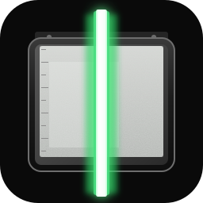

  

<h1 align="center">PolyglotScan</h1>

  Native D desktop scanner with a <strong>full-size, zoomable preview</strong> — so faded receipts are not crushed by a postage-stamp pane.

  <a href="https://polyglotscan.com">polyglotscan.com</a>
  ·
  <a href="https://github.com/PolyglotScan/polyglotscan">source</a>
  ·
  <a href="https://github.com/PolyglotScan/polyglotscan/blob/main/LICENSE">Brand Guardian License 1.0 Standard</a>

## What we build

WIA, TWAIN, and eSCL as the baseline. Vendor extras (Epson and later others) as plugins — never as an official-looking vendor clone. Official builds are ad-free.

## Marks

The name **PolyglotScan**, this lamp-and-platen device mark, and `polyglotscan.com` are reserved Branding. Forks rename. Store-clone spam is [Prohibited Distribution](https://github.com/PolyglotScan/polyglotscan/blob/main/TRADEMARK.adoc).
